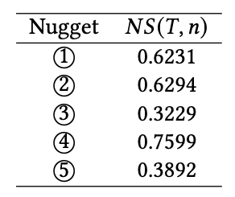

# Nugget-Level-Evaluation

The repository for the ACM SIGIR-AP 2023 Paper, *Open Domain Dialogue Quality Evaluation: Deriving Nugget-level Scores from Turn-level Scores*

A link to paper available from here: [link]

## Explanation

This is a repository showing the example code of how the Nugget-Level Evaluation can be calculated using a turn-level evaluation framework.

We implemented an example experiment to retrieve nugget-level engagingness scores using the EnDex framework (Xu et al., 2022)

The EnDex framework can be found here:
https://drive.google.com/file/d/1ph4P471n0LoM1vbsarj3wvEkpijhwCms/view?usp=sharing

---
We tested to calculate the nugget-level engagingness scores of each nugget in the following system turn:

```
You are interested in SIGIR AP? According to the homepage, you should write a paper of 2-9 pages. I recommend that you review the Call for Papers to check the relevant topics. Good luck!
```

## Usage
The dataset file, and all the parameters (w_ø, w_diff, w_same, K, L) can be adjusted in config.py.

Make sure you have appropriate versions of pytorch and huggingface transformers installed

```
our version:
torch.__version__ == 2.0.1
transformers.__version__==4.33.2
```

## Test Results
The results we achieved in the case study is as folllows:


